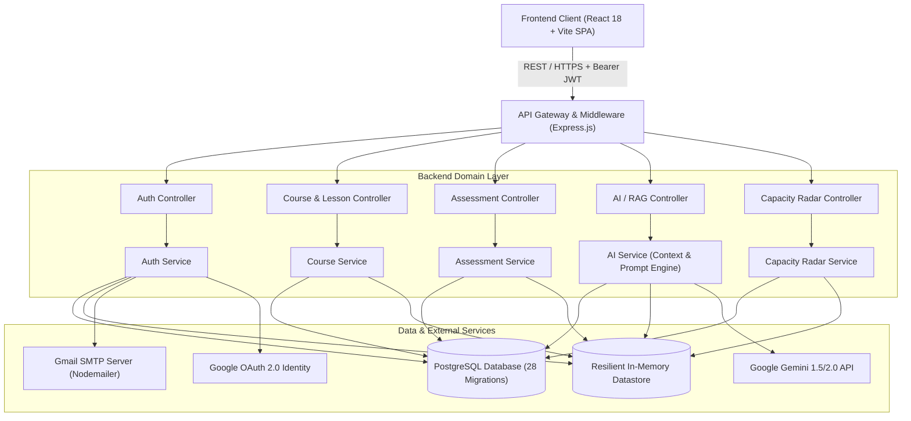
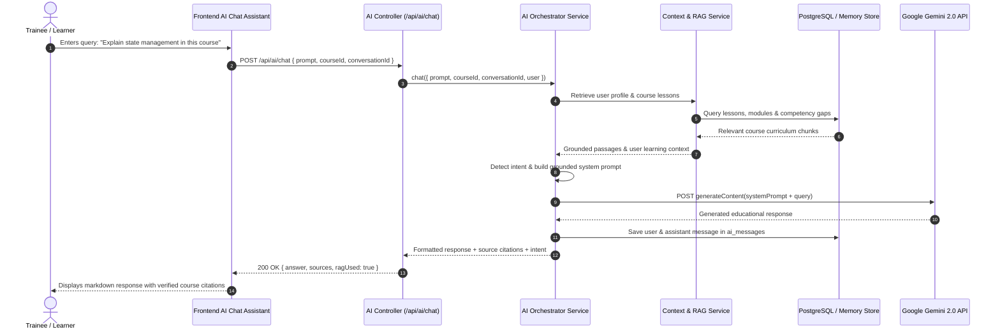

# Capacity Connect System Architecture

This document provides a comprehensive technical overview of the **Capacity Connect** architecture, detailing design patterns, subsystem boundaries, data flow diagrams, and component interactions.

---

## 1. System Overview & Clean Architecture

Capacity Connect is engineered following the **Clean Layered Architecture** paradigm to enforce separation of concerns, high maintainability, and testability across all domain verticals.

---

## 2. Frontend Subsystem Architecture

The frontend is built as a single-page application (SPA) using **React 18** and bundled with **Vite**.

### Core Modules:
1. **Routing & Guards** (`src/routes/AppRoutes.jsx`, `src/components/common/ProtectedRoute.jsx`):
   - Declarative routing with React Router DOM v6.
   - `ProtectedRoute` enforces authentication and Role-Based Access Control (RBAC) across 3 tiers (`trainee`, `trainer`, `administrator`).
2. **Context & State Management** (`src/context/`):
   - `AuthContext`: Manages current user profile, JWT token persistence in `localStorage`, and login/logout state transitions.
   - `AppContext`: Global UI state and notifications.
3. **HTTP Transport Layer** (`src/services/api.js`):
   - Centralized Axios instance automatically injecting `Authorization: Bearer <token>` on all requests.
   - Global error interceptor handling 401 unauthenticated session invalidations and automated redirects.
4. **Data Visualization** (`src/components/capacity/`, `src/components/competency/`):
   - Recharts-powered Radar Charts, Spider graphs, Bar graphs, and Heatmaps for skill deficit and capacity visualization.

---

## 3. Backend Subsystem Architecture

The backend is built on **Node.js (v18+)** and **Express.js (v4)** adhering to a strict **Controller-Service-Model** pattern.

### Layer Responsibilities:
- **Controllers** (`src/controllers/`): Validate incoming HTTP inputs, handle HTTP status codes, and call services.
- **Services** (`src/services/`): Execute business rules, perform data aggregation, coordinate external APIs (Gemini, Nodemailer), and compute metrics (e.g. Skill Gaps, Capacity Scores, Training ROI).
- **Models** (`src/models/`): Encapsulate SQL queries and in-memory datastore fallbacks for data consistency.
- **Middlewares** (`src/middleware/`):
  - `authMiddleware.js`: Validates Bearer JWT signatures using HMAC-SHA256.
  - `roleMiddleware.js`: Restricts controller actions to authorized roles.
  - `errorMiddleware.js`: Catches unhandled exceptions and standardizes error responses.
  - `uploadMiddleware.js`: Handles multipart file attachments using Multer.

---

## 4. AI & RAG (Retrieval-Augmented Generation) Architecture

The AI module implements a production-grade grounded RAG pipeline to prevent hallucinations and provide cited course assistance.

---

## 5. Security Architecture

1. **Authentication Schemes**:
   - **JWT Tokens**: HMAC-SHA256 signed tokens containing user `id`, `email`, and `role` with 7-day expiration.
   - **Email OTPs**: Single-use 6-digit verification codes hashed via SHA-256 with 10-minute expiry and 30-second rate-limiting cooldowns.
   - **Google OAuth 2.0**: Backend token verification against Google's tokeninfo API.
2. **Password Security**:
   - Cryptographic salting and hashing using `bcryptjs` with 10 rounds of salt generation.
3. **Role-Based Access Control (RBAC)**:
   - Three distinct permission tiers:
     - `Trainee`: Learning portal, course progress, quiz attempts, personal skill gaps.
     - `Trainer`: Course management, quiz authoring, trainee progress reporting.
     - `Administrator`: User management, department administration, organizational capacity radar.
4. **Certificate Verification**:
   - Cryptographically random hashes (`CC-CERT-XXXXXX`) publicly verifiable through a dedicated verification endpoint (`/certificates/verify/:hash`).
